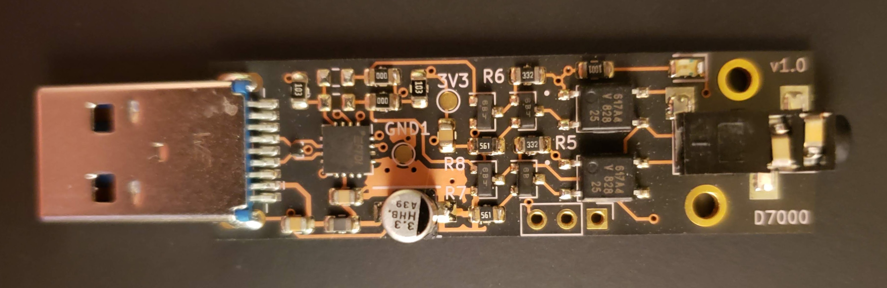

# Hardware shutter control for astrophotography 

## Intro
* Done in KiCad 
* Tested with [NINA]( https://nighttime-imaging.eu/ ) and Nikon D7000
* Works with this cable [ZWO ASIAIR N3]( https://astronomy-imaging-camera.com/product/zwo-shutter-release-cable-for-asiair-pro )
* [Video of board being soldered]( https://www.youtube.com/watch?v=h37NhTkAf3A&t)
* Uses RTS and/or CTS signal(s) from an USB to UART bridge to control shutter release and exposure time
